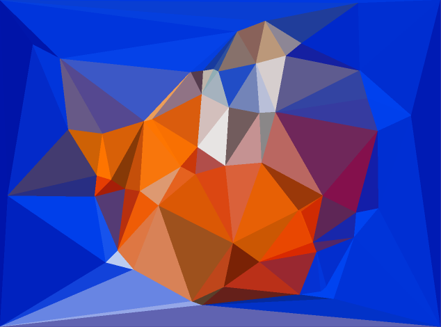
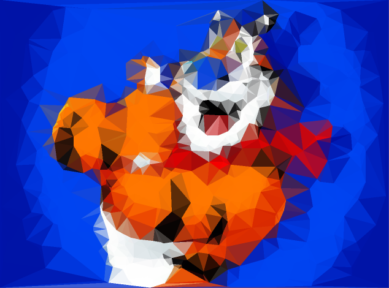

# Poly Art - Tony the Tiger

## Reference
1. https://cosmiccoding.com.au/tutorials/lowpoly
2. https://www.dailymail.co.uk/news/article-6646643/Not-grrreat-Labour-pushes-ban-Tony-Tiger-cartoon-characters-cereal-packets.html
3. https://pinetools.com/adjust-hue-image

## Basic Approach
1. Load our image in
2. Manipulate the image to highlight edges and areas of detail
3. Draw potential vertices from those areas
4. Calculate triangles from vertices
5. Determine the colour of the triangles
6. Plot the image

## Orginal

## Poly Transformation

## Hue Transformation

## Animation with ffmpeg

